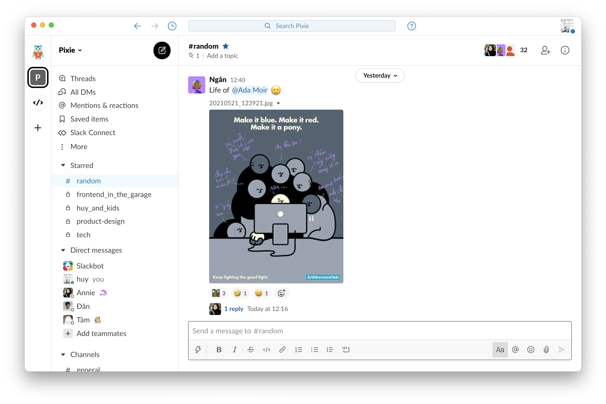

# Mochi White for Slack

A true light theme with pastel colors for your comfort and calm.

## Mochi White Purple

### Screenshots


### Colors
```
#FFFFFF,#F8F8FA,#F3F1FF,#7F4CC8,#F7F7F7,#000000,#05A277,#DE1C58,#FFFFFF,#7F4CC8
```

## Mochi White Blue

### Screenshots


### Colors
```
#FFFFFF,#F8F8FA,#F2FAFF,#1976A7,#F7F7F7,#000000,#05A277,#DE1C58,#FFFFFF,#1976A7
```

## Install

1. In Slack, go to __Preferences__ > __Themes__ > __Colors__.
2. Click __Create a custom theme__.
3. Paste the values below the theme you love into the text box.

## License

[MIT License](./LICENSE)
